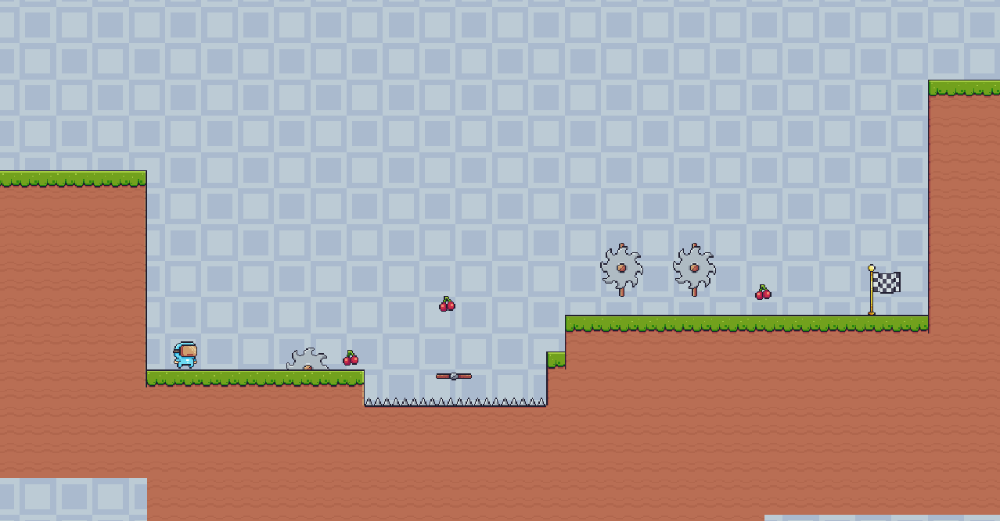
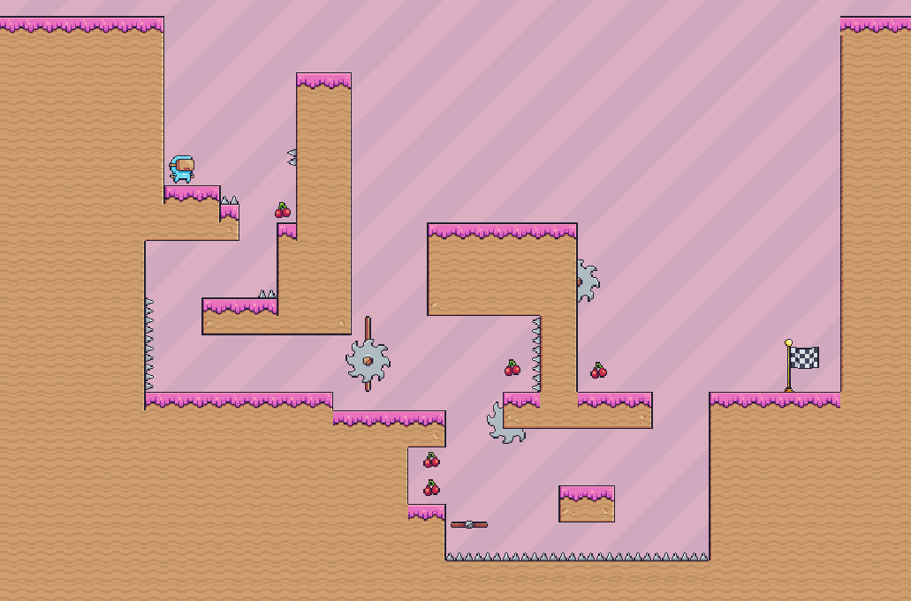
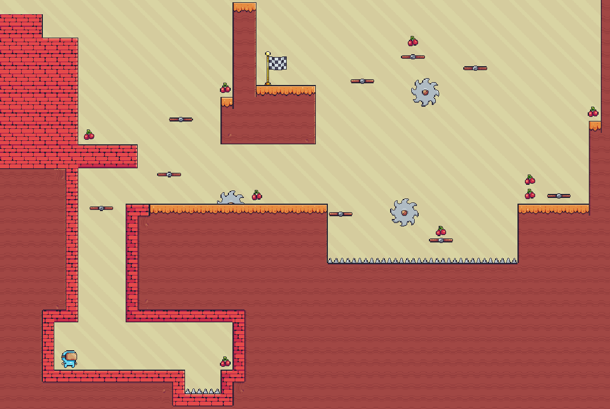
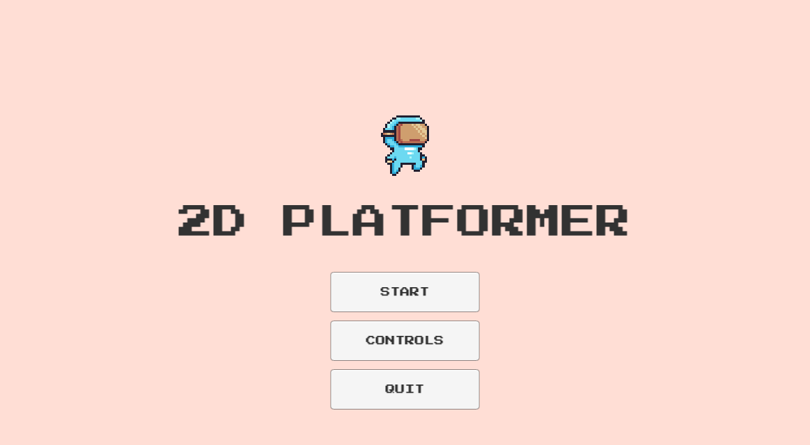
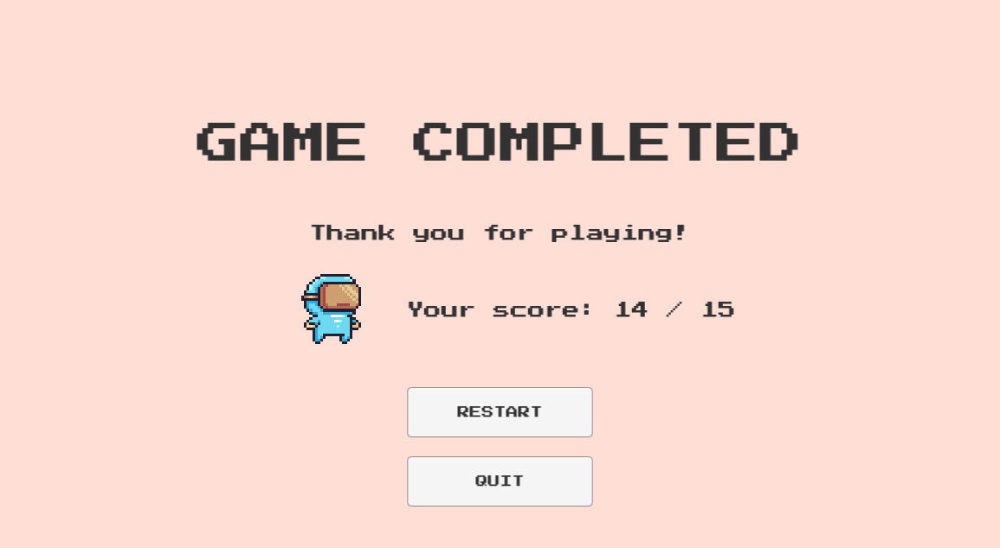

# 2D platformer

This is term paper - 2D platformer game made with Unity

## Project description

- Responsive controls for player character
- Camera follows the player
- Collectable items on levels
- Player score throughout the game
- Handling damage to player from obstacles
- Static and moving platforms with certain paths
- Animations for player, collectable items and moving platforms
- Background music and corresponding sounds for events: jumping, collecting item, ending level, taking damage
- Main menu, end game menu, pause menu
- Three levels to demonstrate the capabilities of the developed game

Unity version used is 2021.2.14

## Used assets:

- [Pixel Adventure 1](https://assetstore.unity.com/packages/2d/characters/pixel-adventure-1-155360)
- [FREE Casual Game SFX Pack](https://assetstore.unity.com/packages/audio/sound-fx/free-casual-game-sfx-pack-54116)

## Results

:link:[Link to youtube for demonstration](https://youtu.be/NCLP5JiYBUQ?si=Ao1bnJUREfXenGPr)

|  |
|:--------------------------------:|
|           _First level_          |

|  |
|:--------------------------------:|
|          _Second level_          |

|  |
|:--------------------------------:|
|            Third level           |

|  |
|:------------------------------------:|
|              _Main menu_             |

|  |
|:-----------------------------------:|
|           _End game menu_           |